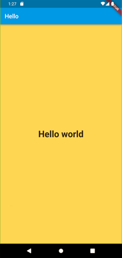

# Hello_World
A new Flutter project. Which can help you to understand how a very simple hello world flutter app looks like. 

### Use Cases
In this app you can
1. See hello world on a colored screen

### Use Case and Description

<<<<<<< HEAD
1. #### See hello world
   You would be able to see a hello world written in the center of a screen on a colorful screen. There is no special functionality 
or anything else to show in this app.
=======
This project is a starting point for a Flutter application.
This is first project to practice and get started with flutter.
This project have no special purpose or any special functionality.

>>>>>>> origin/main

